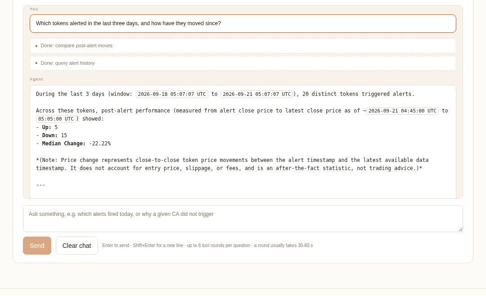

# Alpha-Reset

**[English](README.md) · [中文](README.zh-CN.md)**

A production monitoring system that watches tokens discussed in private trading groups and alerts when one pulls back from a fresh high — with every claim it makes traceable to stored evidence.

**Live:** <https://alpha.nbmrjun.top> · no login, read-only, served from local data.


*One question, two tool calls, real numbers out of the local database — 21 seconds end to end. The key is the visitor's own; this machine forwards it and stores nothing.*

---

## Orbio Build Week

Two connections, not one.

### The agent layer runs on Orbio

The site has a **chat tab**: bring your own Orbio key and ask the system questions in plain language — *"why did nothing alert today"*, *"is anyone real talking about this token"*. Five read-only tools are exposed to the model, which decides what to call.

The server holds **zero inference credentials**. It lifts the key out of the request body, puts it in `Authorization`, forwards the body verbatim and returns the response verbatim. It does not parse, store, or log the conversation. That claim is checkable in the same way the pure-function rule is:

```bash
grep -rn "OPENROUTER_API_KEY\|ORBIO_KEY" src/web/   # must print nothing
```

The key travels in the request **body**, never in a URL, because nginx writes URLs to its access log. It lives in the browser's `localStorage` and nowhere else — as does the conversation, since navigation is plain `<a>` links and every tab switch is a full page load.



Each tool declares a JSON Schema with `additionalProperties: false` and passes a zod gate before reaching the query layer, so a hallucinated parameter is rejected in front of the database rather than inside it.

### `$ORBIO` is also monitored

`$ORBIO` trades on **Robinhood Chain**, one of the three chains this system watches most (44 of 210 tokens, 21%, behind BSC and Arc as of this writing). Supporting that chain is why the market-data source was migrated in the first place — the original provider has no Robinhood Chain candles at all.

`$ORBIO` is monitored not as a demo but because it was mentioned in the watched groups:

**→ <https://alpha.nbmrjun.top/ca/0xaa07a0e9209e16ac99708c3ec70159c6ef3128a3>**

| | |
|---|---|
| Chain | robinhood |
| A1 (age) / A2 (size) | pass / **fail** — market cap has run to $85.5M, past the configured $40M ceiling, so A2 no longer holds |
| Accumulated candles | 1,863 × 15m from Binance Web3, the current scoring source; its GMGN series holds 2,171 bars — the deepest single series in the system |
| How it entered the pool | mentioned in two of the three observed groups |

That A2 failure is worth leaving in. The rules do not get relaxed for the host's own token: it grew past the size band this strategy targets, so the system stops alerting on it and says why.

## What it does

1. **Discover** — every 5 minutes, pull the tokens mentioned in three private trading groups and publish a deduplicated watchlist. All three groups must succeed, or the previous complete list is kept.
2. **Collect** — continuously sweep the watchlist for 15m candles through three independent, rate-limited queues (Binance Web3 180 req/min, GMGN 30 req/min, GeckoTerminal 8 req/min), each with its own cooldown and fair-ordering that survives restarts.
3. **Score** — on the hour, read one consistent snapshot out of local SQLite and evaluate the rules. No network call is inside the scoring transaction.
4. **Alert** — deliver merged Telegram messages with per-tag cooldowns, and store the indicator snapshot taken at trigger time.
5. **Check the crowd** — two minutes after an alert fires, look up what X is saying about that contract and record whether the attention is organic or bought. Deliberately after the fact: the lookup takes 3–20 s and must never sit in the delivery path.
6. **Ask** — optionally, bring your own Orbio key and interrogate all of the above in natural language.

A token alerts only when **A1 ∧ A2 ∧ A3 ∧ A4** all hold: old enough, inside the size band, pulled back from a recorded high, and strong on relative-strength ranking.

## Five design choices worth reading the code for

### 1. Rules are pure functions, enforced by grep

`src/indicators/` and `src/rules/` may not call `fetch`, read `Date.now()`, or touch the database. Every input arrives as an argument. This is not a convention — it is the acceptance criterion:

```bash
grep -rn "fetch(\|Date\.now()" src/indicators src/rules   # must print nothing
```

That property is what makes the rule layer testable without mocks and reviewable without running it.

### 2. Missing data narrows a range instead of inventing a number

Relative strength is a cross-sectional ranking, so it needs every member priced at the same instant. Real pools do not cooperate. Rather than dropping absent members (which flatters the score) or guessing a price, the ranking emits an **interval**:

```
lower = (1 − (rank + missing) / N) × 100     // every missing member beats you
upper = (1 − rank / N) × 100                 // every missing member loses to you
```

A rule fires only when `lower` alone clears the threshold. Exact scores are published only when the ranking is genuinely complete — otherwise the score stays `null` and the page shows `≥81.2` or `52.3–75.0` instead of a fabricated point value.

### 3. Exclusion requires upstream evidence, never local absence

A watchlist accumulates dead tokens, and they drag coverage below the threshold forever. Excluding them is correct — but only when there is positive proof the market is gone, not when the local fetch merely failed:

- **has history** → excluded when the newest *upstream* candle is older than `inactiveAfterBars`, verified by querying the provider directly and confirming its latest bar matches what is stored locally
- **no history** → excluded only on `dexStatus === 'absent'`, meaning DexScreener answered `HTTP 200` with `pairs: null`

`dexStatus` distinguishes `absent` (upstream answered, no market exists) from `error` (the request failed). A collection outage produces `error`, keeps members in the denominator, drops coverage, and correctly blocks alerting instead of quietly shrinking the pool. See [docs/18](docs/18-失活剔除与无市场判定.md).

### 4. The system measures its own signals against a control

Every scoring timestamp records **all members that passed A1∧A2 and had a close price** — not just the ones that alerted. `alerted` separates the two groups in the same table, so the honest question can be asked: *did the triggered tokens do better than the qualifying tokens that did not trigger?*

Forward returns at 1h / 4h / 24h are settled later from local candles, using the **same series** both endpoints came from. Zero upstream requests. Results are at `/api/outcomes` and on the alert-history page.

The first thing this measurement did was contradict an impression. Over 94 historical alert events the triggered group's median 1h return was **−1.2%**, not the win it looked like from eyeballing recent deliveries. It also showed all three `low_vol_*` tags with negative medians while `60m_2d_high_pullback` and `rsi_lt50_60m` were the only consistently positive ones.

Those numbers are **not yet actionable**: 17 assets, top three accounting for half the sample, three days, no exit rule, and — critically — the control group is empty for all historical rounds because the qualifying set per round was never persisted. The UI says so in place of the comparison rather than letting an empty control read as outperformance. Control data accrues from the moment the feature shipped.

### 5. Social proof is measured as forgery, and then checked against what happened

The obvious way to add a sentiment input is a "mentions" count. Measuring first killed that design.

Sample: the 20 tweets mentioning a Solana token this system had just alerted on. Fifteen were one template with rotated emoji, pointing at `token-drop` / `meme-drops` / `memecoins-giveaway` / `solana-drops` — different netlify subdomains, same landing page. The posting accounts were registered 2010–2016 with 30k+ historical tweets and bios unrelated to crypto: rented or stolen real accounts, not fresh burners. Median view count was **76** — the platform had already classified the batch as spam and given it no distribution.

Mention volume is therefore an **inverse** indicator: a high count means someone is paying for it, which usually precedes a dump.

Detection is multi-signal scoring, threshold 3:

| signal | pts |
|---|---|
| belongs to a template cluster | 2 |
| zombie account — under 50 following but over 1000 followers, or 20+ posts/day | 2 |
| landing page on throwaway hosting or a link shortener | 1 |
| that host recurs 3+ times in the result set | 1 |
| view count under 200 | 1 |

**Text similarity alone was not enough.** Clustering by de-stopworded Jaccard at 0.45 failed to connect three posts from the same batch whose pairwise similarity was only 0.37 — the template has several wordings, not one. Union-find over *text similarity **or** shared landing-page domain* connects them: a spammer varies copy far more readily than the page being sold.

Against the hand-labelled sample all 15 manufactured posts are caught and none of the 5 organic ones is flagged. The separation holds on live data too — across the verdicts recorded so far, the median view count is **40 for `manufactured` and 446 for `organic`**, a factor of eleven. That number is not an input to the scoring; it is the platform's own distribution decision agreeing with it.

**The point is not to label alerts.** Every verdict is written next to `alert_outcomes`, keyed by the same `(ca, fired_at)`, so the honest question becomes a join: *do the tokens whose hype was bought actually do worse afterwards?* The `/social` board shows that comparison, and says plainly that it means nothing yet — with a dozen samples it flips sign every few hours. It will mean something in a few months, and if the answer is no, that is a result too.

Cost is $0.0001 per lookup, throttled to one per token per six hours and 200 per day (about $0.02). See [docs/19](docs/19-社交面质量.md).

## Other properties

- **Three market sources are never spliced.** A series is identified by source + chain + contract + pool + currency + format version. GeckoTerminal is pool-scoped; Binance Web3 and GMGN are token-scoped; measured close-price divergence between them is 0.2–0.8% median, so one source's new price is never written into another's history. Source is frozen for a scoring timestamp and only switched, deliberately, at the next one.
- **Late data revises, it does not restart.** The same timestamp is recomputed at most every 3 minutes, deduplicated by an input fingerprint, and republished with an incremented revision.
- **The page never calls upstream.** Lists and stats are built from the saved calculation; a shared WebSocket pushes local snapshots. More viewers cost zero additional upstream requests.
- **Bilingual UI.** English or Chinese by browser language, with a manual toggle that persists and updates `<html lang>`.

## Current numbers

| | |
|---|---|
| Watchlist | 210 tokens; BSC, Arc and Robinhood Chain are the three largest |
| Stored candles | 610,077 × 15m; deepest single series 2,171 bars |
| Active series | 139 Binance Web3 (token) + 57 GeckoTerminal (pinned pool) |
| Historical contracts archived | 2,207 |
| Alerts recorded / delivered | 826 / 587 |
| Social verdicts recorded | 26 so far — median views 40 for `manufactured`, 446 for `organic` |
| Agent tools | 6 read-only, 1 of which reaches an external API |
| Tests | 429 backend + 18 browser, all passing |
| Source | ~10,200 lines of app code including the web UI, ~8,600 lines of tests |

## Stack

Node 24 · TypeScript (ESM, strict) · better-sqlite3 · zod · `node:test` · Vite + React 19 + lightweight-charts · Playwright

Upstreams: Binance Web3 / GMGN / GeckoTerminal / DexScreener for market data · Orbio as the bring-your-own-key model gateway · xapi for social data.

## Run it

```bash
npm ci
npm test            # 387 backend tests; mock upstreams, temp SQLite, no network, no real token
npm run test:web    # 18 browser tests (needs: npx playwright install --with-deps chromium)

cp .env.example .env && chmod 600 .env            # the scheduler's credentials
cp .env.web.example .env.web && chmod 600 .env.web  # the web process: XAPI_KEY only
npm run web         # JSON API on 127.0.0.1:8787
npm run dev:web     # UI on 127.0.0.1:5173, proxies /api
npm start           # the scheduler
npm run dry-run     # real upstream reads, no Telegram delivery
```

Both services bind to loopback only. `deploy/` holds the nginx and systemd templates, kept in sync with what actually runs in production.

Three things in those templates are load-bearing, and skipping them breaks the agent rather than merely weakening it:

- `location /api/agent/` needs `proxy_read_timeout 120s` and `proxy_buffering off`. One round of tool calls takes 30–60 s; the 60 s default cuts the chat off mid-answer.
- The security headers must sit **inside** `location /`. nginx's `add_header` does not inherit: the moment a child location declares one of its own, every header from the parent is dropped. Put them at `server` level and `curl -I` shows none of them.
- `limit_req_zone` must be declared before the `server` block, in the `http` context.

The two credential files are separate on purpose. `alpha-web` is the only process exposed to public requests, and it needs nothing but `XAPI_KEY` — so it must not be handed the Telegram bot token that can post to your alert channel. Pointing systemd at `.env.web` is not enough by itself: `loadConfig()` calls `loadEnvFile()` on its own, so the unit also sets `ENV_FILE`.

## What you actually get if you deploy this yourself

Worth stating plainly, because the repository runs but the system does not come with data:

| | Works out of the box | What it needs |
|---|---|---|
| **Agent chat** | ✅ | Nothing from you — each visitor brings their own Orbio key, and the server holds no inference credentials |
| **`social_check`** | ✅ | Your own `XAPI_KEY` (free to register). ~$0.0001 per query |
| **Market collection** | ✅ | `XAPI_KEY` for Binance Web3; GeckoTerminal needs no key |
| **Watchlist and alerts** | ❌ | An `ERWA_API_TOKEN` and access to the three private groups this system reads |

The rules, the indicators, the ranking, the exclusion logic and the agent layer are all here and all tested. What is not here — and cannot be — is the group access that fills the watchlist. Without it `ERWA_API_TOKEN` takes the placeholder value, group discovery returns nothing, and the pool stays empty: the scheduler runs, the pages render, and there is nothing in them.

So: deploy it to read the code, to reuse the agent layer, or to point the collectors at your own source. Do not expect alerts to appear on their own.

Set `DRY_RUN=1` to exercise the whole pipeline against real upstreams without delivering anything to Telegram.

## Configuration

Strategy thresholds live in [`config/strategy.json`](config/strategy.json), validated by `loadStrategy()`, which recursively ignores `$comment`-prefixed keys. `config/strategy.local.json` overrides it and is git-ignored — the repository copy carries placeholder group names.

**Secrets never enter the repository.** They live only in `.env` (mode 600, git-ignored); `.env.example` is the only committed sample and contains placeholders.

## Documentation

Design notes are written as a running record — each one states what was measured, what it cost, and what was rejected. They are in Chinese.

| Document | Topic |
|---|---|
| [02](docs/02-二娃API参考.md) | Group data API: auth, endpoints, quota |
| [03](docs/03-可行性与约束.md) | Hard constraints found by measurement before any code |
| [04](docs/04-架构设计.md) | Implementation contract: layers, schema, signatures |
| [06](docs/06-前端设计.md) | Frontend contract: design system, pages, charts |
| [09](docs/09-部署运维.md) | Deployment, systemd, backups, known traps |
| [10](docs/10-K线数据源.md) | Why GeckoTerminal: per-chain availability and depth |
| [12](docs/12-上游响应与超时.md) | Upstream latency measurements behind the timeout values |
| [13](docs/13-接入与口径修正.md) | **Current market contract** — series identity, exact endpoints |
| [14](docs/14-动态观察池与限流.md) | Dynamic watchlist, task split, rate budget |
| [15](docs/15-GMGN联合接入实测.md) | Measured divergence: why two sources cannot be spliced |
| [16](docs/16-GMGN正式评分.md) | Dual-source scoring and controlled switchover |
| [17](docs/17-小时评分与轻量推送.md) | Hourly scoring, revision gate, lightweight reads |
| [18](docs/18-失活剔除与无市场判定.md) | **Ranking denominator** — evidence-based exclusion |
| [19](docs/19-社交面质量.md) | **Social-proof quality** — why mention volume is inverse, and how forgery is scored |
| [AGENTS.md](AGENTS.md) | Rules AI coding assistants read automatically |

## Limits worth stating

- **Coverage is the binding constraint, not the rules.** With a free market-data tier the full sweep takes ~30 minutes, so a signal can land up to ~50 minutes after the close it is based on. Raising the rate limit — not changing the strategy — is the fix.
- **"All-time high" means all-time within this system's stored series.** Depth is bounded by what has been accumulated since the series was pinned, and by the provider's single-page limit.
- **Group lists may be truncated.** Each group returns at most 200 entries per call; when that ceiling is hit the page says so rather than implying the list is complete.
- **Social detection is calibrated on one sample.** The thresholds come from 20 tweets about a single token. A different language, or a different spam vendor, may defeat them. The honest fix is to store each verdict alongside the alert and check it against forward returns the way §4 does for the rules — that is not built; the check runs only when someone asks.
- **Not financial advice.** This is a monitoring tool. It reports what the rules matched and the evidence behind it; it does not recommend anything.
